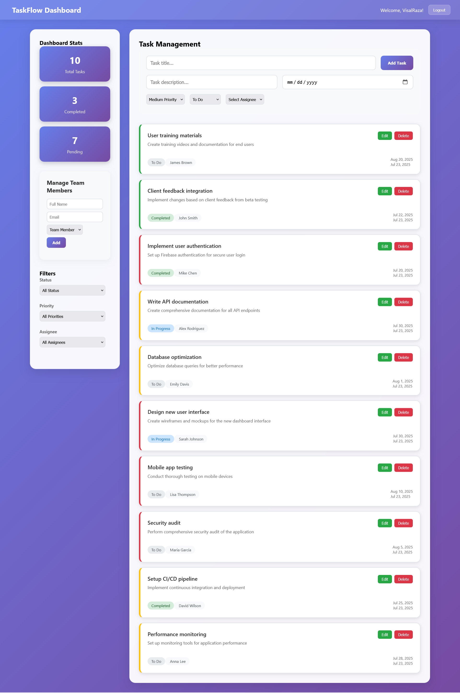

# 📋 TaskFlow

A sleek, responsive task management dashboard built with **Vue 3 + Firebase** for an imaginary startup of 15 employees. This app supports user authentication, task creation, filtering, and real-time updates — all deployed on Firebase Hosting.

---

## 🚀 Features

- 🔐 **Firebase Authentication** (Login & Registration)
- ✅ **CRUD operations** on tasks (Create, Read, Update, Delete)
- 🧠 **Task filters** by status, priority, and assignee
- 📈 **Dashboard statistics**: total, completed, and pending tasks
- 👤 **Assignee Manager**: Add or remove team members dynamically
- ☁️ **Firestore integration** for real-time data sync
- 📦 **Firebase Hosting** for live deployment

---

## 🖼️ Preview



---

## 🛠️ Tech Stack

- [Vue 3](https://vuejs.org/)
- [Vite](https://vitejs.dev/)
- [Firebase (Auth + Firestore + Hosting)](https://firebase.google.com/)
- [CSS3](https://developer.mozilla.org/en-US/docs/Web/CSS)

---

## ⚙️ Installation & Setup

1. **Clone the repository**

```bash
git clone https://github.com/yourusername/taskflow-vue.git
cd taskflow-vue
```

2. **Install dependencies**

```bash
npm install
```

3. **Set up Firebase environment variables
Create a .env file in the root of taskflow-vue/ and add:**

```.env
VITE_API_KEY=your_firebase_api_key
VITE_AUTH_DOMAIN=your_project.firebaseapp.com
VITE_PROJECT_ID=your_project_id
VITE_STORAGE_BUCKET=your_project.appspot.com
VITE_MESSAGING_SENDER_ID=your_messaging_sender_id
VITE_APP_ID=your_app_id
```

4. Run the development server

```bash 
npm run dev
```

**The app will be live at http://localhost:5173**

## 🔥Firebase Deployment

1. Build for production

```bash 
npm run build
```

2. Deploy to Firebase

```bash
firebase deploy
```

## 📁 Folder Structure

```bash
taskflow-vue/
├── src/
│   ├── components/      # Vue components (LoginForm, TaskForm, Filters, etc.)
│   ├── assets/          # CSS, SVGs
│   ├── views/           # AuthPage.vue, Dashboard.vue
│   ├── App.vue          # Root component
│   ├── main.js          # Entry point
│   └── firebase.js      # Firebase configuration
├── public/
├── .env
├── package.json
├── firebase.json
└── README.md
```

## 🧪 Future Improvements

- ⏰ Task deadlines with notifications

- 🗂️ Sortable task list and drag/drop statuses

- 📊 Team performance analytics

- 📆 Calendar integration

## 📃 License

MIT License. Feel free to fork and customize for your own needs.

## Made with 💙 by Visal Raza Zaidi or GitHub